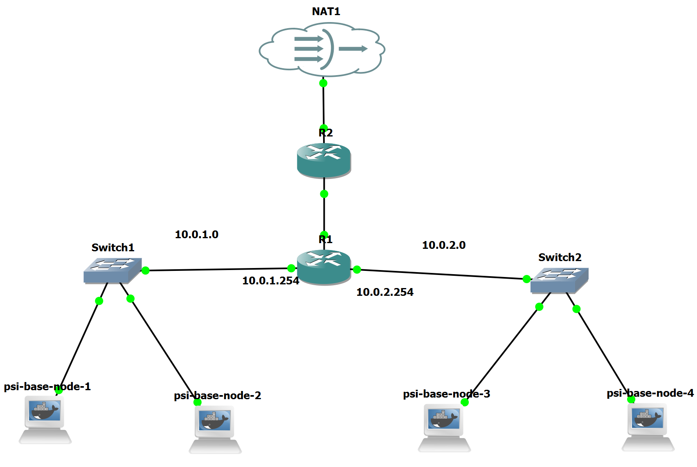

# PSI_SP2
 
# Popis
Python script umožňující zjistit topologii sítě pomocí protokolu SNMP.

Topologie sítě zahrnuje všechny routery a zařízení, které jsou k nim připojená.

Připojená zařízení k routeru lze přes SNMP zjistit pomocí ARP tabulky. S výjimkou switchů, které v našem případě operují pouze na L2 a nemají tak přiřazenou IP adresu.  

Všechny naše routery musí mít povolené SNMP, jinak nebudou v topologii zahrnuty. SNMP lze na Cisco routerech povolit následovně:
```
configure terminal
snmp-server community public RW
```
# Závislosti aplikace
Aplikace vyzažuje knihovny pysnmp a scapy, ty lze nainstalovat pomocí:
```
pip3 install scapy
pip3 install pysnmp
```
Nebo lze použít docker container `psi-base-node`.

# Spuštění aplikace
Po nainstalování závislostí lze aplikaci spustit pomocí:
```
python3 ./main.py
```

# Algoritmus
Aplikace provádí nasledující kroky:
1) Získání IP lokálního DHCP serveru (Router 1) pomocí scapy 
2) Spuštění procedury `snmp_explore` nad touto IP 
3) Krok 2) opakujeme, pro každou novou IP routeru, nalezenou procedurou `snmp_explore`
4) V případě, kdy již nelze prozkoumat zádný další router, pokračuj krokem 5)
5) Vypiš výsledek programu do souboru `./out.txt`

Kroky vykonávané `snmp_explore`:
1) Ověř, zda zařízení podporuje SNMP, pokud ne, konec
2) Získej informace o všech interface routeru, přidej IP rozhraní do prozkoumaných adres
3) Získej ARP tabulku routeru, z ní získej IP připojených endpointů
4) Získej Routing tabulku, z ní získej IP doposud neprozkoumaných routerů
5) Vrať info o tomto routeru a nově nalezené routery

# Architektura
Celý program je obsažen v jednom souboru main.py. Případně by bylo vhodné program fragmentovat do několika souborů a 
zajistit větší obecnost některý funkcí.  

# Výstup Programu

## Ukázka výstupu (out.txt)
```
Result of network topology scan at: 2024-11-30 04:14:35 UTC

##############################################################
ROUTER No. 1 (10.0.1.254)

Endpoints connected to this router:
192.168.1.1
10.0.1.1
10.0.2.1
10.0.1.13
10.0.2.2

Interfaces of this router:
No.		IP	    	Mask
3		10.0.1.254		255.255.255.0
4		10.0.2.254		255.255.255.0
5		192.168.1.2		255.255.255.252

##############################################################
ROUTER No. 2 (192.168.1.1)

Endpoints connected to this router:
192.168.122.1

Interfaces of this router:
No.		IP		Mask
3		192.168.1.1		255.255.255.252
4		192.168.122.233		255.255.255.0
```

## Ukázka výstupu (stdout)
```
root@psi-base-node-1:~# /bin/python3 /root/src/main.py

Local DHCP server's IP is: 10.0.1.254
----------------------------------------------------------

-------------------------------
Exploring 10.0.1.254...
-------------------------------

Is 10.0.1.254 an SNMP agent? Result: True
----------------------------------------------------------
Getting interface info for 10.0.1.254 via SNMP...

get-response: 1.3.6.1.2.1.4.20.1.1.10.0.1.254 = 10.0.1.254
get-response: 1.3.6.1.2.1.4.20.1.1.10.0.2.254 = 10.0.2.254
get-response: 1.3.6.1.2.1.4.20.1.1.192.168.1.2 = 192.168.1.2
get-response: 1.3.6.1.2.1.4.20.1.2.10.0.1.254 = 3
get-response: 1.3.6.1.2.1.4.20.1.2.10.0.2.254 = 4
get-response: 1.3.6.1.2.1.4.20.1.2.192.168.1.2 = 5
get-response: 1.3.6.1.2.1.4.20.1.3.10.0.1.254 = 255.255.255.0
get-response: 1.3.6.1.2.1.4.20.1.3.10.0.2.254 = 255.255.255.0
get-response: 1.3.6.1.2.1.4.20.1.3.192.168.1.2 = 255.255.255.252
get-response: 1.3.6.1.2.1.4.20.1.4.10.0.1.254 = 1
get-response: 1.3.6.1.2.1.4.20.1.4.10.0.2.254 = 1
get-response: 1.3.6.1.2.1.4.20.1.4.192.168.1.2 = 1
get-response: 1.3.6.1.2.1.4.20.1.5.10.0.1.254 = 18024
get-response: 1.3.6.1.2.1.4.20.1.5.10.0.2.254 = 18024
get-response: 1.3.6.1.2.1.4.20.1.5.192.168.1.2 = 18024

Sent 16 get-next-request packets in total.
----------------------------------------------------------
Getting ARP table info for 10.0.1.254 via SNMP...

get-response: 1.3.6.1.2.1.3.1.1.1.3.1.10.0.1.1 = 3
get-response: 1.3.6.1.2.1.3.1.1.1.3.1.10.0.1.13 = 3
get-response: 1.3.6.1.2.1.3.1.1.1.3.1.10.0.1.254 = 3
get-response: 1.3.6.1.2.1.3.1.1.1.4.1.10.0.2.1 = 4
get-response: 1.3.6.1.2.1.3.1.1.1.4.1.10.0.2.2 = 4
get-response: 1.3.6.1.2.1.3.1.1.1.4.1.10.0.2.254 = 4
get-response: 1.3.6.1.2.1.3.1.1.1.5.1.192.168.1.1 = 5
get-response: 1.3.6.1.2.1.3.1.1.1.5.1.192.168.1.2 = 5
get-response: 1.3.6.1.2.1.3.1.1.2.3.1.10.0.1.1 = 0x0242905e3300
get-response: 1.3.6.1.2.1.3.1.1.2.3.1.10.0.1.13 = 0x0242bd513000
get-response: 1.3.6.1.2.1.3.1.1.2.3.1.10.0.1.254 = 0xca010505001c
get-response: 1.3.6.1.2.1.3.1.1.2.4.1.10.0.2.1 = 0x0242eb703c00
get-response: 1.3.6.1.2.1.3.1.1.2.4.1.10.0.2.2 = 0x0242f30a9800
get-response: 1.3.6.1.2.1.3.1.1.2.4.1.10.0.2.254 = 0xca0105050038
get-response: 1.3.6.1.2.1.3.1.1.2.5.1.192.168.1.1 = 0xca02dfe4001c
get-response: 1.3.6.1.2.1.3.1.1.2.5.1.192.168.1.2 = 0xca0105050054
get-response: 1.3.6.1.2.1.3.1.1.3.3.1.10.0.1.1 = 10.0.1.1
get-response: 1.3.6.1.2.1.3.1.1.3.3.1.10.0.1.13 = 10.0.1.13
get-response: 1.3.6.1.2.1.3.1.1.3.3.1.10.0.1.254 = 10.0.1.254
get-response: 1.3.6.1.2.1.3.1.1.3.4.1.10.0.2.1 = 10.0.2.1
get-response: 1.3.6.1.2.1.3.1.1.3.4.1.10.0.2.2 = 10.0.2.2
get-response: 1.3.6.1.2.1.3.1.1.3.4.1.10.0.2.254 = 10.0.2.254
get-response: 1.3.6.1.2.1.3.1.1.3.5.1.192.168.1.1 = 192.168.1.1
get-response: 1.3.6.1.2.1.3.1.1.3.5.1.192.168.1.2 = 192.168.1.2

Sent 25 get-next-request packets in total.
----------------------------------------------------------
Getting routing table info for 10.0.1.254 via SNMP...

get-response: 1.3.6.1.2.1.4.24.4.1.1.0.0.0.0.0.0.0.0.0.192.168.1.1 = 0.0.0.0
get-response: 1.3.6.1.2.1.4.24.4.1.1.10.0.1.0.255.255.255.0.0.0.0.0.0 = 10.0.1.0
get-response: 1.3.6.1.2.1.4.24.4.1.1.10.0.1.254.255.255.255.255.0.0.0.0.0 = 10.0.1.254
get-response: 1.3.6.1.2.1.4.24.4.1.1.10.0.2.0.255.255.255.0.0.0.0.0.0 = 10.0.2.0
get-response: 1.3.6.1.2.1.4.24.4.1.1.10.0.2.254.255.255.255.255.0.0.0.0.0 = 10.0.2.254
get-response: 1.3.6.1.2.1.4.24.4.1.1.192.168.1.0.255.255.255.252.0.0.0.0.0 = 192.168.1.0
get-response: 1.3.6.1.2.1.4.24.4.1.1.192.168.1.2.255.255.255.255.0.0.0.0.0 = 192.168.1.2
get-response: 1.3.6.1.2.1.4.24.4.1.2.0.0.0.0.0.0.0.0.0.192.168.1.1 = 0.0.0.0
get-response: 1.3.6.1.2.1.4.24.4.1.2.10.0.1.0.255.255.255.0.0.0.0.0.0 = 255.255.255.0
get-response: 1.3.6.1.2.1.4.24.4.1.2.10.0.1.254.255.255.255.255.0.0.0.0.0 = 255.255.255.255
get-response: 1.3.6.1.2.1.4.24.4.1.2.10.0.2.0.255.255.255.0.0.0.0.0.0 = 255.255.255.0
get-response: 1.3.6.1.2.1.4.24.4.1.2.10.0.2.254.255.255.255.255.0.0.0.0.0 = 255.255.255.255
get-response: 1.3.6.1.2.1.4.24.4.1.2.192.168.1.0.255.255.255.252.0.0.0.0.0 = 255.255.255.252
get-response: 1.3.6.1.2.1.4.24.4.1.2.192.168.1.2.255.255.255.255.0.0.0.0.0 = 255.255.255.255
get-response: 1.3.6.1.2.1.4.24.4.1.3.0.0.0.0.0.0.0.0.0.192.168.1.1 = 0
get-response: 1.3.6.1.2.1.4.24.4.1.3.10.0.1.0.255.255.255.0.0.0.0.0.0 = 0
get-response: 1.3.6.1.2.1.4.24.4.1.3.10.0.1.254.255.255.255.255.0.0.0.0.0 = 0
get-response: 1.3.6.1.2.1.4.24.4.1.3.10.0.2.0.255.255.255.0.0.0.0.0.0 = 0
get-response: 1.3.6.1.2.1.4.24.4.1.3.10.0.2.254.255.255.255.255.0.0.0.0.0 = 0
get-response: 1.3.6.1.2.1.4.24.4.1.3.192.168.1.0.255.255.255.252.0.0.0.0.0 = 0
get-response: 1.3.6.1.2.1.4.24.4.1.3.192.168.1.2.255.255.255.255.0.0.0.0.0 = 0
get-response: 1.3.6.1.2.1.4.24.4.1.4.0.0.0.0.0.0.0.0.0.192.168.1.1 = 192.168.1.1
get-response: 1.3.6.1.2.1.4.24.4.1.4.10.0.1.0.255.255.255.0.0.0.0.0.0 = 0.0.0.0
get-response: 1.3.6.1.2.1.4.24.4.1.4.10.0.1.254.255.255.255.255.0.0.0.0.0 = 0.0.0.0
get-response: 1.3.6.1.2.1.4.24.4.1.4.10.0.2.0.255.255.255.0.0.0.0.0.0 = 0.0.0.0
get-response: 1.3.6.1.2.1.4.24.4.1.4.10.0.2.254.255.255.255.255.0.0.0.0.0 = 0.0.0.0
get-response: 1.3.6.1.2.1.4.24.4.1.4.192.168.1.0.255.255.255.252.0.0.0.0.0 = 0.0.0.0
get-response: 1.3.6.1.2.1.4.24.4.1.4.192.168.1.2.255.255.255.255.0.0.0.0.0 = 0.0.0.0
get-response: 1.3.6.1.2.1.4.24.4.1.5.0.0.0.0.0.0.0.0.0.192.168.1.1 = 0
get-response: 1.3.6.1.2.1.4.24.4.1.5.10.0.1.0.255.255.255.0.0.0.0.0.0 = 3
get-response: 1.3.6.1.2.1.4.24.4.1.5.10.0.1.254.255.255.255.255.0.0.0.0.0 = 3
get-response: 1.3.6.1.2.1.4.24.4.1.5.10.0.2.0.255.255.255.0.0.0.0.0.0 = 4
get-response: 1.3.6.1.2.1.4.24.4.1.5.10.0.2.254.255.255.255.255.0.0.0.0.0 = 4
get-response: 1.3.6.1.2.1.4.24.4.1.5.192.168.1.0.255.255.255.252.0.0.0.0.0 = 5
get-response: 1.3.6.1.2.1.4.24.4.1.5.192.168.1.2.255.255.255.255.0.0.0.0.0 = 5
get-response: 1.3.6.1.2.1.4.24.4.1.6.0.0.0.0.0.0.0.0.0.192.168.1.1 = 4
get-response: 1.3.6.1.2.1.4.24.4.1.6.10.0.1.0.255.255.255.0.0.0.0.0.0 = 3
get-response: 1.3.6.1.2.1.4.24.4.1.6.10.0.1.254.255.255.255.255.0.0.0.0.0 = 3
get-response: 1.3.6.1.2.1.4.24.4.1.6.10.0.2.0.255.255.255.0.0.0.0.0.0 = 3
get-response: 1.3.6.1.2.1.4.24.4.1.6.10.0.2.254.255.255.255.255.0.0.0.0.0 = 3
get-response: 1.3.6.1.2.1.4.24.4.1.6.192.168.1.0.255.255.255.252.0.0.0.0.0 = 3
get-response: 1.3.6.1.2.1.4.24.4.1.6.192.168.1.2.255.255.255.255.0.0.0.0.0 = 3
get-response: 1.3.6.1.2.1.4.24.4.1.7.0.0.0.0.0.0.0.0.0.192.168.1.1 = 3
get-response: 1.3.6.1.2.1.4.24.4.1.7.10.0.1.0.255.255.255.0.0.0.0.0.0 = 2
get-response: 1.3.6.1.2.1.4.24.4.1.7.10.0.1.254.255.255.255.255.0.0.0.0.0 = 2
get-response: 1.3.6.1.2.1.4.24.4.1.7.10.0.2.0.255.255.255.0.0.0.0.0.0 = 2
get-response: 1.3.6.1.2.1.4.24.4.1.7.10.0.2.254.255.255.255.255.0.0.0.0.0 = 2
get-response: 1.3.6.1.2.1.4.24.4.1.7.192.168.1.0.255.255.255.252.0.0.0.0.0 = 2
get-response: 1.3.6.1.2.1.4.24.4.1.7.192.168.1.2.255.255.255.255.0.0.0.0.0 = 2
get-response: 1.3.6.1.2.1.4.24.4.1.8.0.0.0.0.0.0.0.0.0.192.168.1.1 = 26626
get-response: 1.3.6.1.2.1.4.24.4.1.8.10.0.1.0.255.255.255.0.0.0.0.0.0 = 26626
get-response: 1.3.6.1.2.1.4.24.4.1.8.10.0.1.254.255.255.255.255.0.0.0.0.0 = 26626
get-response: 1.3.6.1.2.1.4.24.4.1.8.10.0.2.0.255.255.255.0.0.0.0.0.0 = 26626
get-response: 1.3.6.1.2.1.4.24.4.1.8.10.0.2.254.255.255.255.255.0.0.0.0.0 = 26626
get-response: 1.3.6.1.2.1.4.24.4.1.8.192.168.1.0.255.255.255.252.0.0.0.0.0 = 26626
get-response: 1.3.6.1.2.1.4.24.4.1.8.192.168.1.2.255.255.255.255.0.0.0.0.0 = 26626
get-response: 1.3.6.1.2.1.4.24.4.1.9.0.0.0.0.0.0.0.0.0.192.168.1.1 = 0.0
get-response: 1.3.6.1.2.1.4.24.4.1.9.10.0.1.0.255.255.255.0.0.0.0.0.0 = 0.0
get-response: 1.3.6.1.2.1.4.24.4.1.9.10.0.1.254.255.255.255.255.0.0.0.0.0 = 0.0
get-response: 1.3.6.1.2.1.4.24.4.1.9.10.0.2.0.255.255.255.0.0.0.0.0.0 = 0.0
get-response: 1.3.6.1.2.1.4.24.4.1.9.10.0.2.254.255.255.255.255.0.0.0.0.0 = 0.0
get-response: 1.3.6.1.2.1.4.24.4.1.9.192.168.1.0.255.255.255.252.0.0.0.0.0 = 0.0
get-response: 1.3.6.1.2.1.4.24.4.1.9.192.168.1.2.255.255.255.255.0.0.0.0.0 = 0.0
get-response: 1.3.6.1.2.1.4.24.4.1.10.0.0.0.0.0.0.0.0.0.192.168.1.1 = 0
get-response: 1.3.6.1.2.1.4.24.4.1.10.10.0.1.0.255.255.255.0.0.0.0.0.0 = 0
get-response: 1.3.6.1.2.1.4.24.4.1.10.10.0.1.254.255.255.255.255.0.0.0.0.0 = 0
get-response: 1.3.6.1.2.1.4.24.4.1.10.10.0.2.0.255.255.255.0.0.0.0.0.0 = 0
get-response: 1.3.6.1.2.1.4.24.4.1.10.10.0.2.254.255.255.255.255.0.0.0.0.0 = 0
get-response: 1.3.6.1.2.1.4.24.4.1.10.192.168.1.0.255.255.255.252.0.0.0.0.0 = 0
get-response: 1.3.6.1.2.1.4.24.4.1.10.192.168.1.2.255.255.255.255.0.0.0.0.0 = 0
get-response: 1.3.6.1.2.1.4.24.4.1.11.0.0.0.0.0.0.0.0.0.192.168.1.1 = 0
get-response: 1.3.6.1.2.1.4.24.4.1.11.10.0.1.0.255.255.255.0.0.0.0.0.0 = 0
get-response: 1.3.6.1.2.1.4.24.4.1.11.10.0.1.254.255.255.255.255.0.0.0.0.0 = 0
get-response: 1.3.6.1.2.1.4.24.4.1.11.10.0.2.0.255.255.255.0.0.0.0.0.0 = 0
get-response: 1.3.6.1.2.1.4.24.4.1.11.10.0.2.254.255.255.255.255.0.0.0.0.0 = 0
get-response: 1.3.6.1.2.1.4.24.4.1.11.192.168.1.0.255.255.255.252.0.0.0.0.0 = 0
get-response: 1.3.6.1.2.1.4.24.4.1.11.192.168.1.2.255.255.255.255.0.0.0.0.0 = 0
get-response: 1.3.6.1.2.1.4.24.4.1.12.0.0.0.0.0.0.0.0.0.192.168.1.1 = -1
get-response: 1.3.6.1.2.1.4.24.4.1.12.10.0.1.0.255.255.255.0.0.0.0.0.0 = -1
get-response: 1.3.6.1.2.1.4.24.4.1.12.10.0.1.254.255.255.255.255.0.0.0.0.0 = -1
get-response: 1.3.6.1.2.1.4.24.4.1.12.10.0.2.0.255.255.255.0.0.0.0.0.0 = -1
get-response: 1.3.6.1.2.1.4.24.4.1.12.10.0.2.254.255.255.255.255.0.0.0.0.0 = -1
get-response: 1.3.6.1.2.1.4.24.4.1.12.192.168.1.0.255.255.255.252.0.0.0.0.0 = -1
get-response: 1.3.6.1.2.1.4.24.4.1.12.192.168.1.2.255.255.255.255.0.0.0.0.0 = -1
get-response: 1.3.6.1.2.1.4.24.4.1.13.0.0.0.0.0.0.0.0.0.192.168.1.1 = -1
get-response: 1.3.6.1.2.1.4.24.4.1.13.10.0.1.0.255.255.255.0.0.0.0.0.0 = -1
get-response: 1.3.6.1.2.1.4.24.4.1.13.10.0.1.254.255.255.255.255.0.0.0.0.0 = -1
get-response: 1.3.6.1.2.1.4.24.4.1.13.10.0.2.0.255.255.255.0.0.0.0.0.0 = -1
get-response: 1.3.6.1.2.1.4.24.4.1.13.10.0.2.254.255.255.255.255.0.0.0.0.0 = -1
get-response: 1.3.6.1.2.1.4.24.4.1.13.192.168.1.0.255.255.255.252.0.0.0.0.0 = -1
get-response: 1.3.6.1.2.1.4.24.4.1.13.192.168.1.2.255.255.255.255.0.0.0.0.0 = -1
get-response: 1.3.6.1.2.1.4.24.4.1.14.0.0.0.0.0.0.0.0.0.192.168.1.1 = -1
get-response: 1.3.6.1.2.1.4.24.4.1.14.10.0.1.0.255.255.255.0.0.0.0.0.0 = -1
get-response: 1.3.6.1.2.1.4.24.4.1.14.10.0.1.254.255.255.255.255.0.0.0.0.0 = -1
get-response: 1.3.6.1.2.1.4.24.4.1.14.10.0.2.0.255.255.255.0.0.0.0.0.0 = -1
get-response: 1.3.6.1.2.1.4.24.4.1.14.10.0.2.254.255.255.255.255.0.0.0.0.0 = -1
get-response: 1.3.6.1.2.1.4.24.4.1.14.192.168.1.0.255.255.255.252.0.0.0.0.0 = -1
get-response: 1.3.6.1.2.1.4.24.4.1.14.192.168.1.2.255.255.255.255.0.0.0.0.0 = -1
get-response: 1.3.6.1.2.1.4.24.4.1.15.0.0.0.0.0.0.0.0.0.192.168.1.1 = -1
get-response: 1.3.6.1.2.1.4.24.4.1.15.10.0.1.0.255.255.255.0.0.0.0.0.0 = -1
get-response: 1.3.6.1.2.1.4.24.4.1.15.10.0.1.254.255.255.255.255.0.0.0.0.0 = -1
get-response: 1.3.6.1.2.1.4.24.4.1.15.10.0.2.0.255.255.255.0.0.0.0.0.0 = -1
get-response: 1.3.6.1.2.1.4.24.4.1.15.10.0.2.254.255.255.255.255.0.0.0.0.0 = -1
get-response: 1.3.6.1.2.1.4.24.4.1.15.192.168.1.0.255.255.255.252.0.0.0.0.0 = -1
get-response: 1.3.6.1.2.1.4.24.4.1.15.192.168.1.2.255.255.255.255.0.0.0.0.0 = -1
get-response: 1.3.6.1.2.1.4.24.4.1.16.0.0.0.0.0.0.0.0.0.192.168.1.1 = 1
get-response: 1.3.6.1.2.1.4.24.4.1.16.10.0.1.0.255.255.255.0.0.0.0.0.0 = 1
get-response: 1.3.6.1.2.1.4.24.4.1.16.10.0.1.254.255.255.255.255.0.0.0.0.0 = 1
get-response: 1.3.6.1.2.1.4.24.4.1.16.10.0.2.0.255.255.255.0.0.0.0.0.0 = 1
get-response: 1.3.6.1.2.1.4.24.4.1.16.10.0.2.254.255.255.255.255.0.0.0.0.0 = 1
get-response: 1.3.6.1.2.1.4.24.4.1.16.192.168.1.0.255.255.255.252.0.0.0.0.0 = 1
get-response: 1.3.6.1.2.1.4.24.4.1.16.192.168.1.2.255.255.255.255.0.0.0.0.0 = 1

Sent 113 get-next-request packets in total.
----------------------------------------------------------
Discovered unexplored routers: {'192.168.1.1'}


-------------------------------
Exploring 192.168.1.1...
-------------------------------

Is 192.168.1.1 an SNMP agent? Result: True
----------------------------------------------------------
Getting interface info for 192.168.1.1 via SNMP...

get-response: 1.3.6.1.2.1.4.20.1.1.192.168.1.1 = 192.168.1.1
get-response: 1.3.6.1.2.1.4.20.1.1.192.168.122.233 = 192.168.122.233
get-response: 1.3.6.1.2.1.4.20.1.2.192.168.1.1 = 3
get-response: 1.3.6.1.2.1.4.20.1.2.192.168.122.233 = 4
get-response: 1.3.6.1.2.1.4.20.1.3.192.168.1.1 = 255.255.255.252
get-response: 1.3.6.1.2.1.4.20.1.3.192.168.122.233 = 255.255.255.0
get-response: 1.3.6.1.2.1.4.20.1.4.192.168.1.1 = 1
get-response: 1.3.6.1.2.1.4.20.1.4.192.168.122.233 = 1
get-response: 1.3.6.1.2.1.4.20.1.5.192.168.1.1 = 18024
get-response: 1.3.6.1.2.1.4.20.1.5.192.168.122.233 = 18024

Sent 11 get-next-request packets in total.
----------------------------------------------------------
Getting ARP table info for 192.168.1.1 via SNMP...

get-response: 1.3.6.1.2.1.3.1.1.1.3.1.192.168.1.1 = 3
get-response: 1.3.6.1.2.1.3.1.1.1.3.1.192.168.1.2 = 3
get-response: 1.3.6.1.2.1.3.1.1.1.4.1.192.168.122.1 = 4
get-response: 1.3.6.1.2.1.3.1.1.1.4.1.192.168.122.233 = 4
get-response: 1.3.6.1.2.1.3.1.1.2.3.1.192.168.1.1 = 0xca02dfe4001c
get-response: 1.3.6.1.2.1.3.1.1.2.3.1.192.168.1.2 = 0xca0105050054
get-response: 1.3.6.1.2.1.3.1.1.2.4.1.192.168.122.1 = 0x5254002304c2
get-response: 1.3.6.1.2.1.3.1.1.2.4.1.192.168.122.233 = 0xca02dfe40038
get-response: 1.3.6.1.2.1.3.1.1.3.3.1.192.168.1.1 = 192.168.1.1
get-response: 1.3.6.1.2.1.3.1.1.3.3.1.192.168.1.2 = 192.168.1.2
get-response: 1.3.6.1.2.1.3.1.1.3.4.1.192.168.122.1 = 192.168.122.1
get-response: 1.3.6.1.2.1.3.1.1.3.4.1.192.168.122.233 = 192.168.122.233

Sent 13 get-next-request packets in total.
----------------------------------------------------------
Getting routing table info for 192.168.1.1 via SNMP...

get-response: 1.3.6.1.2.1.4.24.4.1.1.0.0.0.0.0.0.0.0.0.192.168.122.1 = 0.0.0.0
get-response: 1.3.6.1.2.1.4.24.4.1.1.10.0.1.0.255.255.255.0.0.192.168.1.2 = 10.0.1.0
get-response: 1.3.6.1.2.1.4.24.4.1.1.10.0.2.0.255.255.255.0.0.192.168.1.2 = 10.0.2.0
get-response: 1.3.6.1.2.1.4.24.4.1.1.192.168.1.0.255.255.255.252.0.0.0.0.0 = 192.168.1.0
get-response: 1.3.6.1.2.1.4.24.4.1.1.192.168.1.1.255.255.255.255.0.0.0.0.0 = 192.168.1.1
get-response: 1.3.6.1.2.1.4.24.4.1.1.192.168.122.0.255.255.255.0.0.0.0.0.0 = 192.168.122.0
get-response: 1.3.6.1.2.1.4.24.4.1.1.192.168.122.233.255.255.255.255.0.0.0.0.0 = 192.168.122.233
get-response: 1.3.6.1.2.1.4.24.4.1.2.0.0.0.0.0.0.0.0.0.192.168.122.1 = 0.0.0.0
get-response: 1.3.6.1.2.1.4.24.4.1.2.10.0.1.0.255.255.255.0.0.192.168.1.2 = 255.255.255.0
get-response: 1.3.6.1.2.1.4.24.4.1.2.10.0.2.0.255.255.255.0.0.192.168.1.2 = 255.255.255.0
get-response: 1.3.6.1.2.1.4.24.4.1.2.192.168.1.0.255.255.255.252.0.0.0.0.0 = 255.255.255.252
get-response: 1.3.6.1.2.1.4.24.4.1.2.192.168.1.1.255.255.255.255.0.0.0.0.0 = 255.255.255.255
get-response: 1.3.6.1.2.1.4.24.4.1.2.192.168.122.0.255.255.255.0.0.0.0.0.0 = 255.255.255.0
get-response: 1.3.6.1.2.1.4.24.4.1.2.192.168.122.233.255.255.255.255.0.0.0.0.0 = 255.255.255.255
get-response: 1.3.6.1.2.1.4.24.4.1.3.0.0.0.0.0.0.0.0.0.192.168.122.1 = 0
get-response: 1.3.6.1.2.1.4.24.4.1.3.10.0.1.0.255.255.255.0.0.192.168.1.2 = 0
get-response: 1.3.6.1.2.1.4.24.4.1.3.10.0.2.0.255.255.255.0.0.192.168.1.2 = 0
get-response: 1.3.6.1.2.1.4.24.4.1.3.192.168.1.0.255.255.255.252.0.0.0.0.0 = 0
get-response: 1.3.6.1.2.1.4.24.4.1.3.192.168.1.1.255.255.255.255.0.0.0.0.0 = 0
get-response: 1.3.6.1.2.1.4.24.4.1.3.192.168.122.0.255.255.255.0.0.0.0.0.0 = 0
get-response: 1.3.6.1.2.1.4.24.4.1.3.192.168.122.233.255.255.255.255.0.0.0.0.0 = 0
get-response: 1.3.6.1.2.1.4.24.4.1.4.0.0.0.0.0.0.0.0.0.192.168.122.1 = 192.168.122.1
get-response: 1.3.6.1.2.1.4.24.4.1.4.10.0.1.0.255.255.255.0.0.192.168.1.2 = 192.168.1.2
get-response: 1.3.6.1.2.1.4.24.4.1.4.10.0.2.0.255.255.255.0.0.192.168.1.2 = 192.168.1.2
get-response: 1.3.6.1.2.1.4.24.4.1.4.192.168.1.0.255.255.255.252.0.0.0.0.0 = 0.0.0.0
get-response: 1.3.6.1.2.1.4.24.4.1.4.192.168.1.1.255.255.255.255.0.0.0.0.0 = 0.0.0.0
get-response: 1.3.6.1.2.1.4.24.4.1.4.192.168.122.0.255.255.255.0.0.0.0.0.0 = 0.0.0.0
get-response: 1.3.6.1.2.1.4.24.4.1.4.192.168.122.233.255.255.255.255.0.0.0.0.0 = 0.0.0.0
get-response: 1.3.6.1.2.1.4.24.4.1.5.0.0.0.0.0.0.0.0.0.192.168.122.1 = 0
get-response: 1.3.6.1.2.1.4.24.4.1.5.10.0.1.0.255.255.255.0.0.192.168.1.2 = 0
get-response: 1.3.6.1.2.1.4.24.4.1.5.10.0.2.0.255.255.255.0.0.192.168.1.2 = 0
get-response: 1.3.6.1.2.1.4.24.4.1.5.192.168.1.0.255.255.255.252.0.0.0.0.0 = 3
get-response: 1.3.6.1.2.1.4.24.4.1.5.192.168.1.1.255.255.255.255.0.0.0.0.0 = 3
get-response: 1.3.6.1.2.1.4.24.4.1.5.192.168.122.0.255.255.255.0.0.0.0.0.0 = 4
get-response: 1.3.6.1.2.1.4.24.4.1.5.192.168.122.233.255.255.255.255.0.0.0.0.0 = 4
get-response: 1.3.6.1.2.1.4.24.4.1.6.0.0.0.0.0.0.0.0.0.192.168.122.1 = 4
get-response: 1.3.6.1.2.1.4.24.4.1.6.10.0.1.0.255.255.255.0.0.192.168.1.2 = 4
get-response: 1.3.6.1.2.1.4.24.4.1.6.10.0.2.0.255.255.255.0.0.192.168.1.2 = 4
get-response: 1.3.6.1.2.1.4.24.4.1.6.192.168.1.0.255.255.255.252.0.0.0.0.0 = 3
get-response: 1.3.6.1.2.1.4.24.4.1.6.192.168.1.1.255.255.255.255.0.0.0.0.0 = 3
get-response: 1.3.6.1.2.1.4.24.4.1.6.192.168.122.0.255.255.255.0.0.0.0.0.0 = 3
get-response: 1.3.6.1.2.1.4.24.4.1.6.192.168.122.233.255.255.255.255.0.0.0.0.0 = 3
get-response: 1.3.6.1.2.1.4.24.4.1.7.0.0.0.0.0.0.0.0.0.192.168.122.1 = 3
get-response: 1.3.6.1.2.1.4.24.4.1.7.10.0.1.0.255.255.255.0.0.192.168.1.2 = 3
get-response: 1.3.6.1.2.1.4.24.4.1.7.10.0.2.0.255.255.255.0.0.192.168.1.2 = 3
get-response: 1.3.6.1.2.1.4.24.4.1.7.192.168.1.0.255.255.255.252.0.0.0.0.0 = 2
get-response: 1.3.6.1.2.1.4.24.4.1.7.192.168.1.1.255.255.255.255.0.0.0.0.0 = 2
get-response: 1.3.6.1.2.1.4.24.4.1.7.192.168.122.0.255.255.255.0.0.0.0.0.0 = 2
get-response: 1.3.6.1.2.1.4.24.4.1.7.192.168.122.233.255.255.255.255.0.0.0.0.0 = 2
get-response: 1.3.6.1.2.1.4.24.4.1.8.0.0.0.0.0.0.0.0.0.192.168.122.1 = 420
get-response: 1.3.6.1.2.1.4.24.4.1.8.10.0.1.0.255.255.255.0.0.192.168.1.2 = 26754
get-response: 1.3.6.1.2.1.4.24.4.1.8.10.0.2.0.255.255.255.0.0.192.168.1.2 = 26754
get-response: 1.3.6.1.2.1.4.24.4.1.8.192.168.1.0.255.255.255.252.0.0.0.0.0 = 26751
get-response: 1.3.6.1.2.1.4.24.4.1.8.192.168.1.1.255.255.255.255.0.0.0.0.0 = 26751
get-response: 1.3.6.1.2.1.4.24.4.1.8.192.168.122.0.255.255.255.0.0.0.0.0.0 = 26743
get-response: 1.3.6.1.2.1.4.24.4.1.8.192.168.122.233.255.255.255.255.0.0.0.0.0 = 26743
get-response: 1.3.6.1.2.1.4.24.4.1.9.0.0.0.0.0.0.0.0.0.192.168.122.1 = 0.0
get-response: 1.3.6.1.2.1.4.24.4.1.9.10.0.1.0.255.255.255.0.0.192.168.1.2 = 0.0
get-response: 1.3.6.1.2.1.4.24.4.1.9.10.0.2.0.255.255.255.0.0.192.168.1.2 = 0.0
get-response: 1.3.6.1.2.1.4.24.4.1.9.192.168.1.0.255.255.255.252.0.0.0.0.0 = 0.0
get-response: 1.3.6.1.2.1.4.24.4.1.9.192.168.1.1.255.255.255.255.0.0.0.0.0 = 0.0
get-response: 1.3.6.1.2.1.4.24.4.1.9.192.168.122.0.255.255.255.0.0.0.0.0.0 = 0.0
get-response: 1.3.6.1.2.1.4.24.4.1.9.192.168.122.233.255.255.255.255.0.0.0.0.0 = 0.0
get-response: 1.3.6.1.2.1.4.24.4.1.10.0.0.0.0.0.0.0.0.0.192.168.122.1 = 0
get-response: 1.3.6.1.2.1.4.24.4.1.10.10.0.1.0.255.255.255.0.0.192.168.1.2 = 0
get-response: 1.3.6.1.2.1.4.24.4.1.10.10.0.2.0.255.255.255.0.0.192.168.1.2 = 0
get-response: 1.3.6.1.2.1.4.24.4.1.10.192.168.1.0.255.255.255.252.0.0.0.0.0 = 0
get-response: 1.3.6.1.2.1.4.24.4.1.10.192.168.1.1.255.255.255.255.0.0.0.0.0 = 0
get-response: 1.3.6.1.2.1.4.24.4.1.10.192.168.122.0.255.255.255.0.0.0.0.0.0 = 0
get-response: 1.3.6.1.2.1.4.24.4.1.10.192.168.122.233.255.255.255.255.0.0.0.0.0 = 0
get-response: 1.3.6.1.2.1.4.24.4.1.11.0.0.0.0.0.0.0.0.0.192.168.122.1 = 0
get-response: 1.3.6.1.2.1.4.24.4.1.11.10.0.1.0.255.255.255.0.0.192.168.1.2 = 0
get-response: 1.3.6.1.2.1.4.24.4.1.11.10.0.2.0.255.255.255.0.0.192.168.1.2 = 0
get-response: 1.3.6.1.2.1.4.24.4.1.11.192.168.1.0.255.255.255.252.0.0.0.0.0 = 0
get-response: 1.3.6.1.2.1.4.24.4.1.11.192.168.1.1.255.255.255.255.0.0.0.0.0 = 0
get-response: 1.3.6.1.2.1.4.24.4.1.11.192.168.122.0.255.255.255.0.0.0.0.0.0 = 0
get-response: 1.3.6.1.2.1.4.24.4.1.11.192.168.122.233.255.255.255.255.0.0.0.0.0 = 0
get-response: 1.3.6.1.2.1.4.24.4.1.12.0.0.0.0.0.0.0.0.0.192.168.122.1 = -1
get-response: 1.3.6.1.2.1.4.24.4.1.12.10.0.1.0.255.255.255.0.0.192.168.1.2 = -1
get-response: 1.3.6.1.2.1.4.24.4.1.12.10.0.2.0.255.255.255.0.0.192.168.1.2 = -1
get-response: 1.3.6.1.2.1.4.24.4.1.12.192.168.1.0.255.255.255.252.0.0.0.0.0 = -1
get-response: 1.3.6.1.2.1.4.24.4.1.12.192.168.1.1.255.255.255.255.0.0.0.0.0 = -1
get-response: 1.3.6.1.2.1.4.24.4.1.12.192.168.122.0.255.255.255.0.0.0.0.0.0 = -1
get-response: 1.3.6.1.2.1.4.24.4.1.12.192.168.122.233.255.255.255.255.0.0.0.0.0 = -1
get-response: 1.3.6.1.2.1.4.24.4.1.13.0.0.0.0.0.0.0.0.0.192.168.122.1 = -1
get-response: 1.3.6.1.2.1.4.24.4.1.13.10.0.1.0.255.255.255.0.0.192.168.1.2 = -1
get-response: 1.3.6.1.2.1.4.24.4.1.13.10.0.2.0.255.255.255.0.0.192.168.1.2 = -1
get-response: 1.3.6.1.2.1.4.24.4.1.13.192.168.1.0.255.255.255.252.0.0.0.0.0 = -1
get-response: 1.3.6.1.2.1.4.24.4.1.13.192.168.1.1.255.255.255.255.0.0.0.0.0 = -1
get-response: 1.3.6.1.2.1.4.24.4.1.13.192.168.122.0.255.255.255.0.0.0.0.0.0 = -1
get-response: 1.3.6.1.2.1.4.24.4.1.13.192.168.122.233.255.255.255.255.0.0.0.0.0 = -1
get-response: 1.3.6.1.2.1.4.24.4.1.14.0.0.0.0.0.0.0.0.0.192.168.122.1 = -1
get-response: 1.3.6.1.2.1.4.24.4.1.14.10.0.1.0.255.255.255.0.0.192.168.1.2 = -1
get-response: 1.3.6.1.2.1.4.24.4.1.14.10.0.2.0.255.255.255.0.0.192.168.1.2 = -1
get-response: 1.3.6.1.2.1.4.24.4.1.14.192.168.1.0.255.255.255.252.0.0.0.0.0 = -1
get-response: 1.3.6.1.2.1.4.24.4.1.14.192.168.1.1.255.255.255.255.0.0.0.0.0 = -1
get-response: 1.3.6.1.2.1.4.24.4.1.14.192.168.122.0.255.255.255.0.0.0.0.0.0 = -1
get-response: 1.3.6.1.2.1.4.24.4.1.14.192.168.122.233.255.255.255.255.0.0.0.0.0 = -1
get-response: 1.3.6.1.2.1.4.24.4.1.15.0.0.0.0.0.0.0.0.0.192.168.122.1 = -1
get-response: 1.3.6.1.2.1.4.24.4.1.15.10.0.1.0.255.255.255.0.0.192.168.1.2 = -1
get-response: 1.3.6.1.2.1.4.24.4.1.15.10.0.2.0.255.255.255.0.0.192.168.1.2 = -1
get-response: 1.3.6.1.2.1.4.24.4.1.15.192.168.1.0.255.255.255.252.0.0.0.0.0 = -1
get-response: 1.3.6.1.2.1.4.24.4.1.15.192.168.1.1.255.255.255.255.0.0.0.0.0 = -1
get-response: 1.3.6.1.2.1.4.24.4.1.15.192.168.122.0.255.255.255.0.0.0.0.0.0 = -1
get-response: 1.3.6.1.2.1.4.24.4.1.15.192.168.122.233.255.255.255.255.0.0.0.0.0 = -1
get-response: 1.3.6.1.2.1.4.24.4.1.16.0.0.0.0.0.0.0.0.0.192.168.122.1 = 1
get-response: 1.3.6.1.2.1.4.24.4.1.16.10.0.1.0.255.255.255.0.0.192.168.1.2 = 1
get-response: 1.3.6.1.2.1.4.24.4.1.16.10.0.2.0.255.255.255.0.0.192.168.1.2 = 1
get-response: 1.3.6.1.2.1.4.24.4.1.16.192.168.1.0.255.255.255.252.0.0.0.0.0 = 1
get-response: 1.3.6.1.2.1.4.24.4.1.16.192.168.1.1.255.255.255.255.0.0.0.0.0 = 1
get-response: 1.3.6.1.2.1.4.24.4.1.16.192.168.122.0.255.255.255.0.0.0.0.0.0 = 1
get-response: 1.3.6.1.2.1.4.24.4.1.16.192.168.122.233.255.255.255.255.0.0.0.0.0 = 1

Sent 113 get-next-request packets in total.
----------------------------------------------------------
Discovered unexplored routers: {'192.168.122.1'}


-------------------------------
Exploring 192.168.122.1...
-------------------------------

Is 192.168.122.1 an SNMP agent? Result: False
Cannot proceed further. This device doesn't support SNMP.

-------------------------------
All routers have been explored.
-------------------------------

-------------------------------
Results written into ./out.txt
-------------------------------
```

## GNS3 Topologie

